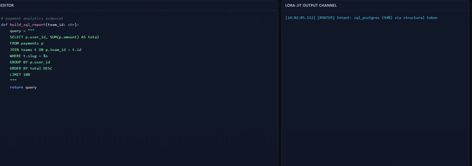

# LoRA-JIT

LoRA-JIT is a **benchmark-first JIT adapter router** for editor-driven inference workloads.

It records live coding context, reconstructs semantic windows from telemetry, benchmarks routing decisions against multiple baselines, and now closes the loop with a live **predict → page → activate** orchestration path that surfaces cache behavior directly inside VS Code.

[](https://github.com/Anandb71/LoRA-jit/actions/workflows/ci.yml)
[](./LICENSE)

> **Tagline:** context-aware adapter routing + paging telemetry you can actually see.

Quick links: [5-minute demo](#5-minute-demo-) · [Benchmark workflow](#full-benchmark-workflow) · [Real runtime backend](#real-runtime-backend-opt-in) · [Development](#development)

## Demo Preview 🎬



The demo shows the full live telemetry loop inside VS Code: route decision, paging state, active runtime backend, and end-to-end JIT timing.

## Why this project exists

Multi-adapter systems are only useful if they can answer one question cheaply and correctly:

> **Which adapter should be active for the next generation step, and can we keep it warm?**

LoRA-JIT is built to answer that question with measurable evidence instead of hand-wavy demos.

Today the project includes:

- A **FastAPI daemon** for telemetry ingest, routing, trace replay, and benchmarking.
- A **VS Code extension** that streams live editor telemetry and now shows routing/cache decisions in the UI.
- A **trace compiler** that reconstructs file state from NDJSON event logs.
- An **ontology-constrained labeling pipeline** for scientifically defensible benchmark data.
- A **closed-loop JIT router** that returns `warm_hit` / `cold_miss` plus hot-set snapshots and latency.

## Current state

What is real right now:

- Live telemetry streaming from VS Code
- Sequence-aware trace repair via heartbeat resync
- Benchmark compile → annotate → compare workflow
- Live `POST /jit/route` orchestration
- VS Code status bar + output channel visualization

What is still simulated:

- Adapter residency is tracked by `PagingSimulator`
- Runtime activation uses `MockRuntime` by default, with an opt-in `PyTorchPeftRuntime` scaffold for local PEFT-backed hot-swapping
- The live router still uses a deterministic baseline predictor, not a trained model

That means the **systems architecture is real and testable today**, while the runtime backend and routing intelligence are the next realism upgrades.

## What success looks like

When LoRA-JIT is working, you can observe the system heartbeat in real time:

- first intent for an adapter → `cold_miss`
- repeated intent → `warm_hit`
- latency drops when the adapter stays hot
- the extension shows the active adapter and cache state without leaving the editor

That warm/cold transition is the core proof that the JIT path is doing something useful.

## Repository map

- `backend/` — daemon, routing, runtime, paging, benchmark, labeling, telemetry
- `vscode-extension/` — VS Code extension that streams telemetry and renders JIT state
- `scripts/` — CLI entrypoints for daemon, compile, annotate, and benchmark replay
- `docs/` — architecture, benchmark methodology, and adapter ontology
- `tests/` — backend regression suite
- `examples/` — sample benchmark artifacts

## 5-minute demo ⚡

If you only want to prove the project works, do this.

### 1) Create the Python environment and install dependencies

Windows PowerShell:

```powershell
py -3.11 -m venv .venv
.\.venv\Scripts\Activate.ps1
python -m pip install -e .[dev]
```

### 2) Start the daemon

```powershell
python scripts/run-daemon.py
```

Expected result: the daemon starts on `http://127.0.0.1:8765`.

### 3) Sanity check the daemon

```powershell
Invoke-RestMethod -Uri 'http://127.0.0.1:8765/health'
```

Expected result:

- `service: lora-jit-daemon`
- `status: ok`

### 4) Prove the JIT loop manually

First request:

```powershell
$body = '{"session_id":"demo-session","event_type":"cursor","file_path":"C:/demo/sql/query.sql","language_id":"sql","sequence_id":1,"cursor_line":10,"cursor_column":4,"symbol_path":["UserQuery","build_report"],"deltas":[],"metadata":{"source":"manual-demo","semantic_context":"UserQuery::build_report"}}'
Invoke-RestMethod -Uri 'http://127.0.0.1:8765/jit/route' -Method Post -ContentType 'application/json' -Body $body | ConvertTo-Json -Depth 5
```

Second request:

```powershell
$body = '{"session_id":"demo-session","event_type":"cursor","file_path":"C:/demo/sql/query.sql","language_id":"sql","sequence_id":2,"cursor_line":10,"cursor_column":4,"symbol_path":["UserQuery","build_report"],"deltas":[],"metadata":{"source":"manual-demo","semantic_context":"UserQuery::build_report"}}'
Invoke-RestMethod -Uri 'http://127.0.0.1:8765/jit/route' -Method Post -ContentType 'application/json' -Body $body | ConvertTo-Json -Depth 5
```

Expected result:

- first call returns `paging_status: "cold_miss"`
- second call returns `paging_status: "warm_hit"`

That transition is the shortest possible proof that the paging/orchestration loop is alive.

### 5) See it inside VS Code

1. Keep the daemon running.
2. Open the repository in VS Code.
3. Press `F5` from the `vscode-extension` project to launch an Extension Development Host.
4. In the new window, open a code file and move the cursor.
5. Watch the bottom-right status bar:
	 - `JIT: <adapter> (warm)`
	 - `JIT: <adapter> (cold)`
6. Click the status bar item to open the `LoRA-JIT` output channel.

Expected log shape:

```text
[14:02:05.112] [ROUTER] Intent: sql_postgres (94%) via structural token — seq #42
[14:02:05.112] [PAGING] sql_postgres: MISS → cold load — evicted: react_hooks (ARC) | hot-set: [python_core, sql_postgres]
[14:02:05.112] [INFER]  Active: sql_postgres | Backend: pytorch-peft
[14:02:05.112] [TIMING] Route: 0.50ms | VRAM Load: 14.20ms | Total JIT: 14.70ms
```

## Full benchmark workflow

### Compare the built-in sample trace

```powershell
python scripts/run-benchmark.py examples/sample-trace.json --compare
```

### Compile a captured trace into benchmark rows

```powershell
python scripts/compile-trace.py traces/<session>.ndjson --rows-output benchmark.rows.json --windows-output benchmark.windows.json
```

### Auto-label those rows

```powershell
python scripts/annotate-benchmark.py benchmark.rows.json --output benchmark.annotated.json --print-ontology
```

### Benchmark the annotated rows

```powershell
python scripts/run-benchmark.py benchmark.annotated.json --compare
```

## Real runtime backend (opt-in)

LoRA-JIT now includes a **`PyTorchPeftRuntime` scaffold** for replacing `MockRuntime` with a local PEFT-backed adapter loader.

This path is intentionally opt-in so CI and normal development do not require heavy ML dependencies.

### Default behavior

- `.env` defaults to `LORA_JIT_RUNTIME_BACKEND=mock`
- the daemon falls back to `MockRuntime` automatically if the PyTorch runtime cannot initialize

### To experiment with the real runtime path

1. Install runtime extras:

```powershell
python -m pip install -e .[runtime]
```

2. Place PEFT adapter directories under `adapters/`, one subdirectory per adapter ID.

3. Update `.env`:

```dotenv
LORA_JIT_RUNTIME_BACKEND=pytorch
LORA_JIT_BASE_MODEL_ID=Qwen/Qwen1.5-0.5B
LORA_JIT_ADAPTER_DIR=adapters
LORA_JIT_DEVICE=cpu
LORA_JIT_EAGER_LOAD=false
```

4. Start the daemon normally:

```powershell
python scripts/run-daemon.py
```

The daemon will attempt to boot `PyTorchPeftRuntime`. If something is missing, it logs the failure and safely falls back to `MockRuntime`.

## Current measured accuracy

On the bundled sample benchmark (`examples/sample-trace.json`), the current predictors measure:

- `structural` → `top1_accuracy = 1.0`
- `text` → `top1_accuracy = 1.0`
- `embedding` → `top1_accuracy = 1.0`

Important caveat: this sample has only **2 easy events**, so it is a smoke test, not a production-quality routing claim.

The benchmark pipeline is mature enough to trust; the bundled dataset is not yet large enough to brag with a straight face.

## Labeling model and ontology

- LoRA-JIT uses an **ontology-constrained** labeling protocol.
- Labels support one `primary_adapter` plus `acceptable_alternatives`.
- Scoring is weighted for ambiguity-aware evaluation.
- `LlmLabelProvider` can be used for offline labeling via:
	- `LORA_JIT_LLM_API_BASE`
	- `LORA_JIT_LLM_API_KEY`

See:

- [`docs/ARCHITECTURE.md`](./docs/ARCHITECTURE.md)
- [`docs/BENCHMARK.md`](./docs/BENCHMARK.md)
- [`docs/ADAPTER_ONTOLOGY.md`](./docs/ADAPTER_ONTOLOGY.md)

## Development

### Backend tests

```powershell
python -m pytest tests/ -v
```

### Python lint

```powershell
python -m ruff check .
```

### Extension type-check

```powershell
cd vscode-extension
npm install
npm run lint
```

## Standards

- License: [MIT](./LICENSE)
- Security policy: [SECURITY.md](./SECURITY.md)
- Contributing guide: [CONTRIBUTING.md](./CONTRIBUTING.md)
- Code of conduct: [CODE_OF_CONDUCT.md](./CODE_OF_CONDUCT.md)
- Changelog: [CHANGELOG.md](./CHANGELOG.md)

## Bottom line

LoRA-JIT already proves something meaningful:

**editor intent can drive a measurable JIT adapter paging loop, and that loop can be benchmarked, visualized, and debugged with real tooling.**

The next frontier is not more scaffolding. It is better data, a smarter predictor, and a real runtime backend.
