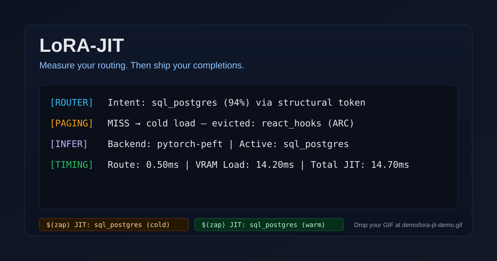

# LoRA-JIT

<p align="center">
  
</p>

**Context-aware LoRA adapter routing for real-time code generation inside VS Code.**

LoRA-JIT watches your editor, classifies what you are working on, and hot-swaps a
specialist fine-tuned model into place in milliseconds — then completes your code
using that domain expert. The full loop runs locally: telemetry capture → intent
classification → adapter paging → GPU activation → token generation.

[](https://github.com/Anandb71/LoRA-jit/actions/workflows/ci.yml)
[](./LICENSE)
[](https://www.python.org/)

> **Measure your routing. Then ship your completions.**
>
> LoRA-JIT is open adapter routing infrastructure — not a Copilot clone.
> Completions are available via API and logged in VS Code; inline ghost text is on the roadmap.
> See [docs/OVERVIEW.md](./docs/OVERVIEW.md) for an honest capability summary.

**Documentation hub:** [docs/INDEX.md](./docs/INDEX.md)

---

## How it works

| Step | What happens |
|------|-------------|
| **1. Observe** | VS Code extension streams cursor, text-change, and symbol events to the daemon |
| **2. Route** | `POST /jit/route` classifies editor intent and selects the best LoRA adapter |
| **3. Page** | `PagingSimulator` tracks which adapters are warm or cold in VRAM |
| **4. Activate** | `PyTorchPeftRuntime` hot-swaps the chosen LoRA weights onto the base model |
| **5. Complete** | `POST /jit/complete` generates tokens using the now-active domain expert |
| **6. Visualise** | Status bar and output channel surface adapter name, cache state, and latency |

Every routing decision is logged with confidence score, paging status
(`warm_hit` / `cold_miss`), activation latency, and generation latency.
Nothing is invisible.

---

## Real measured results

Benchmarked on an **RTX 3050 6 GB laptop** with `Qwen/Qwen1.5-0.5B` + `sql_postgres` LoRA:

| Metric | Value |
|--------|-------|
| First route — cold miss (no preload) | ~6 700 ms |
| First route — warm hit (preload enabled) | **~6 ms** |
| Subsequent warm routes | **6 – 20 ms** |
| Token generation (40 tokens, GPU) | ~7 500 ms |
| Router confidence on SQL files | ~99 % |
| Test suite | **48 / 48 passing** |

---

## Repository layout

```
backend/
  config/         env loader and .env parsing
  contracts/      Pydantic schemas shared across all layers
  daemon/         FastAPI app and all HTTP endpoints
  benchmark/      trace replay runner and predictor comparison
  labeling/       ontology-constrained auto-labeler and LLM labeling
  paging/         hot-set simulation and cache statistics
  routing/        baseline predictors + trainable learned router + JitRouter
  runtime/        MockRuntime + PyTorchPeftRuntime + abstract interface
  telemetry/      rolling buffer, gap detection, trace persistence
vscode-extension/ TypeScript VS Code extension
scripts/          CLI entry points for every workflow
adapters/         LoRA adapter directories (one per adapter ID, gitignored)
data/             SFT training datasets (gitignored)
tests/            48-test regression suite
docs/             Architecture, benchmark guide, adapter ontology
examples/         Sample traces and seed router artifacts
```

---

## Quick start

Full cross-platform guide: [docs/QUICKSTART.md](./docs/QUICKSTART.md)

### 1 — Install

```powershell
# Windows
py -3.11 -m venv .venv
.\.venv\Scripts\Activate.ps1
pip install -e .[dev]
```

```bash
# macOS / Linux
python3.11 -m venv .venv
source .venv/bin/activate
pip install -e .[dev]
```

### 2 — Run all tests

```powershell
pytest tests/ -v
```

Expected: **48 passed**. No GPU required — the test suite uses `MockRuntime`.

### 3 — Start the daemon

```powershell
python scripts/run-daemon.py
```

Or via installed console script:

```powershell
lora-jit-daemon
```

Daemon starts on `http://127.0.0.1:8765`. Interactive API docs at
`http://127.0.0.1:8765/docs`.

### 4 — Prove the JIT paging loop

```powershell
# First call — cold miss
$body = '{"session_id":"demo","event_type":"cursor","file_path":"query.sql","language_id":"sql","sequence_id":1,"cursor_line":0,"cursor_column":36,"full_text":"SELECT id FROM teams WHERE"}'
Invoke-RestMethod -Uri 'http://127.0.0.1:8765/jit/route' -Method Post -ContentType 'application/json' -Body $body | ConvertTo-Json

# Second call — warm hit
$body = '{"session_id":"demo","event_type":"cursor","file_path":"query.sql","language_id":"sql","sequence_id":2,"cursor_line":0,"cursor_column":33,"full_text":"SELECT count FROM orders WHERE"}'
Invoke-RestMethod -Uri 'http://127.0.0.1:8765/jit/route' -Method Post -ContentType 'application/json' -Body $body | ConvertTo-Json
```

First call → `paging_status: "cold_miss"`.
Second call → `paging_status: "warm_hit"`.
That transition proves the JIT paging loop is working.

### 5 — Get a code completion

```powershell
$body = '{"session_id":"demo","file_path":"query.sql","prefix":"SELECT id, name FROM teams WHERE team_id =","max_tokens":40}'
Invoke-RestMethod -Uri 'http://127.0.0.1:8765/jit/complete' -Method Post -ContentType 'application/json' -Body $body | ConvertTo-Json
```

With `MockRuntime` (default) this returns a deterministic stub.
With `PyTorchPeftRuntime` it returns real GPU-generated tokens from the active adapter.

---

## Real GPU path

To run with a real PEFT adapter and actual token generation on GPU:

### 1 — Install ML dependencies

```powershell
pip install -e .[runtime]
```

### 2 — Build the SQL training dataset

```powershell
python scripts/build-sql-dataset.py --size 800 --output data/sql_postgres/train.jsonl
```

### 3 — Train and export the LoRA adapter

```powershell
python scripts/train-peft-adapter.py \
  --adapter-id sql_postgres \
  --dataset data/sql_postgres/train.jsonl \
  --base-model-id Qwen/Qwen1.5-0.5B
```

Takes ~10 minutes on an RTX 3050 6 GB. Adapter saved to `adapters/sql_postgres/`.

### 4 — Verify the artifact

```powershell
python scripts/verify-adapter.py adapters/sql_postgres
```

### 5 — Configure `.env` for real runtime

```bash
cp .env.example .env
```

Key settings (see [`.env.example`](./.env.example) for all options):

```dotenv
LORA_JIT_RUNTIME_BACKEND=pytorch
LORA_JIT_BASE_MODEL_ID=Qwen/Qwen1.5-0.5B
LORA_JIT_ADAPTER_DIR=adapters
LORA_JIT_DEVICE=auto
LORA_JIT_EAGER_LOAD=true
LORA_JIT_PRELOAD_ADAPTERS=sql_postgres
LORA_JIT_PREDICTOR=learned
LORA_JIT_ROUTER_MODEL_PATH=examples/router-model.seed.json
```

### 6 — Restart the daemon

```powershell
python scripts/run-daemon.py
```

First route returns `paging_status: warm_hit` and single-digit `activation_latency_ms`.
`/jit/complete` returns real model output.

---

## VS Code extension

1. Keep the daemon running.
2. Open this repository in VS Code.
3. Press `F5` from inside `vscode-extension/` to launch an Extension Development Host.
4. Open any code file and move the cursor.
5. Bottom-right status bar: `JIT: sql_postgres (warm)` or `JIT: sql_postgres (cold)`.
6. Click the status bar item to open the `LoRA-JIT` output channel.

Output channel format:

```
[14:02:05] [ROUTER] Intent: sql_postgres (99%) — seq #1
[14:02:05] [PAGING] sql_postgres: warm_hit | hot-set: [sql_postgres]
[14:02:05] [INFER]  Active: sql_postgres | Backend: pytorch-peft
[14:02:05] [TIMING] Route: 5.9 ms | Generation: 7 561 ms
```

---

## Benchmark workflow

### Compare all predictors on the sample trace

```powershell
python scripts/run-benchmark.py examples/sample-trace.json --compare
```

### Full trace-to-benchmark pipeline

```powershell
# 1. Compile raw NDJSON trace to benchmark rows
python scripts/compile-trace.py traces/<session>.ndjson \
  --rows-output benchmark.rows.json \
  --windows-output benchmark.windows.json

# 2. Auto-label rows (ontology-constrained)
python scripts/annotate-benchmark.py benchmark.rows.json \
  --output benchmark.annotated.json \
  --print-ontology

# 3. Benchmark all predictors
python scripts/run-benchmark.py benchmark.annotated.json --compare
```

### Train the learned router

```powershell
python scripts/train-router.py benchmark.annotated.json --output models/router.json
python scripts/run-benchmark.py benchmark.annotated.json \
  --predictor learned \
  --model-path models/router.json
```

A seed-trained artifact ships at `examples/router-model.seed.json`.

---

## API reference

| Method | Path | Description |
|--------|------|-------------|
| `GET` | `/health` | Daemon liveness check |
| `POST` | `/jit/route` | Route editor intent → adapter selection + paging update |
| `POST` | `/jit/complete` | Generate tokens from the currently active adapter |
| `POST` | `/jit/preload` | Preload one or more adapters on demand and warm paging state |
| `POST` | `/telemetry/stream` | Ingest a batch of editor telemetry events |
| `GET` | `/telemetry/recent` | Inspect recent buffered events |
| `GET` | `/trace/sessions` | List all stored session trace IDs |
| `GET` | `/trace/session/{id}` | Resolve trace file path for a session |
| `POST` | `/benchmark/run` | Run a single predictor benchmark |
| `POST` | `/benchmark/compare` | Compare all predictor baselines |

Full request/response schemas available at `http://127.0.0.1:8765/docs`.

---

## Environment variables

| Variable | Default | Description |
|----------|---------|-------------|
| `LORA_JIT_RUNTIME_BACKEND` | `mock` | `mock` or `pytorch` |
| `LORA_JIT_BASE_MODEL_ID` | `Qwen/Qwen1.5-0.5B` | HuggingFace model ID |
| `LORA_JIT_ADAPTER_DIR` | `adapters` | Root directory containing adapter subdirectories |
| `LORA_JIT_DEVICE` | `cpu` | `cpu`, `cuda`, or `auto` |
| `LORA_JIT_EAGER_LOAD` | `false` | Load base model at daemon boot |
| `LORA_JIT_PRELOAD_ADAPTERS` | _(empty)_ | Comma-separated adapter IDs to warm at startup |
| `LORA_JIT_STRICT_RUNTIME` | `false` | When `true`, generation failures raise HTTP 500 (no silent fallback) |
| `LORA_JIT_MAX_HOT_ADAPTERS` | `3` | Max adapters in hot-set by count |
| `LORA_JIT_MAX_HOT_MB` | _(empty)_ | Optional approximate MB budget for paging simulator evictions |
| `LORA_JIT_PREDICTOR` | `structural` | `structural`, `text`, `embedding`, or `learned` |
| `LORA_JIT_ROUTER_MODEL_PATH` | _(empty)_ | Path to trained router `.json` artifact |
| `LORA_JIT_LLM_API_BASE` | _(empty)_ | OpenAI-compatible endpoint for offline labeling |
| `LORA_JIT_LLM_API_KEY` | _(empty)_ | API key for the labeling endpoint |

---

## Development

```powershell
pytest tests/ -v          # full test suite (no GPU needed)
python -m ruff check .    # Python lint

lora-jit-daemon           # console script daemon launcher
lora-jit-benchmark ...    # benchmark CLI entry point
lora-jit-compile ...      # trace compiler CLI entry point
lora-jit-annotate ...     # benchmark annotation CLI entry point

cd vscode-extension
npm install
npm run lint              # TypeScript type-check
```

---

## Documentation

| Document | Description |
|----------|-------------|
| [docs/INDEX.md](./docs/INDEX.md) | Documentation hub — start here |
| [docs/OVERVIEW.md](./docs/OVERVIEW.md) | What LoRA-JIT is and is not |
| [docs/QUICKSTART.md](./docs/QUICKSTART.md) | Cross-platform install and GPU path |
| [docs/ARCHITECTURE.md](./docs/ARCHITECTURE.md) | Component design, data flows, runtime tiers |
| [docs/BENCHMARK.md](./docs/BENCHMARK.md) | Benchmark methodology and full trace workflow |
| [docs/ADAPTER_ONTOLOGY.md](./docs/ADAPTER_ONTOLOGY.md) | Authoritative adapter ID registry |
| [docs/FAQ.md](./docs/FAQ.md) | Troubleshooting and common questions |
| [docs/AUDIT.md](./docs/AUDIT.md) | Public release audit and maturity matrix |
| [CHANGELOG.md](./CHANGELOG.md) | Version history |
| [CONTRIBUTING.md](./CONTRIBUTING.md) | Development setup and PR checklist |
| [SECURITY.md](./SECURITY.md) | Vulnerability reporting policy |

---

## License

[MIT](./LICENSE) © 2026 Anand B
